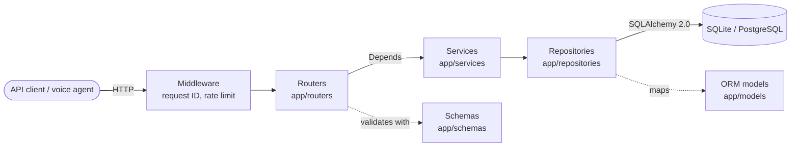
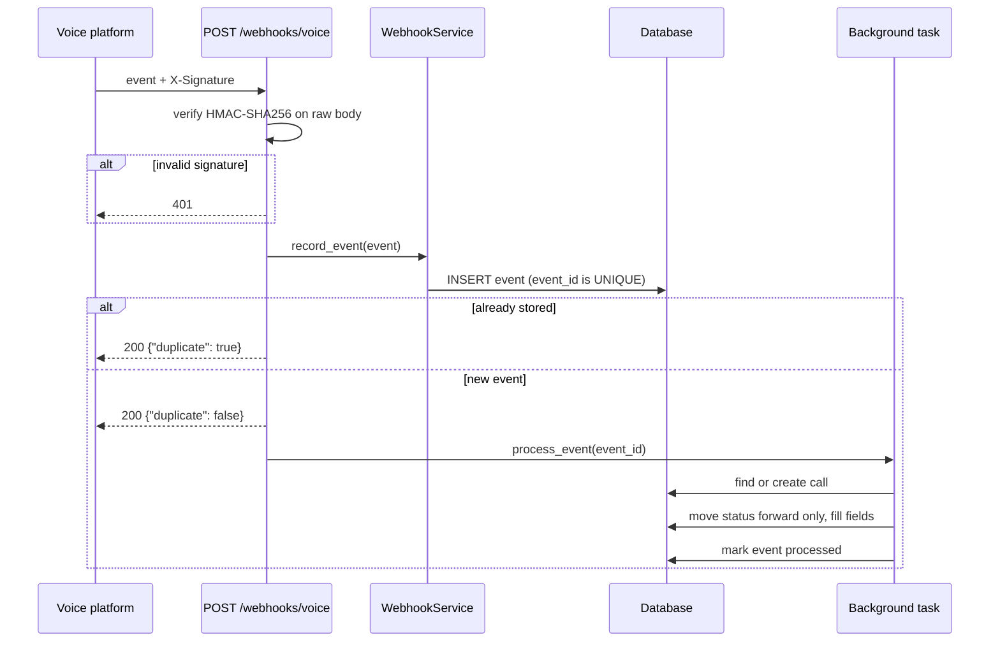

# voice-agent-gateway

A production-style FastAPI backend that connects **voice AI agents** (such as [Retell AI](https://www.retellai.com/)) to **business systems**.

It keeps a record of every call, processes signed call lifecycle webhooks from the voice platform, and exposes **tool endpoints** that a voice agent calls in the middle of a live conversation, for example to check appointment availability and book a slot while the caller is still on the line.

## Features

- **Calls API**: create, fetch, list (with cursor pagination and filters) and update call records.
  - `Idempotency-Key` header makes `POST /calls` safe to retry.
  - Status changes are validated: `registered -> ongoing -> ended | error`. Invalid transitions return `409`.
- **Signed webhooks**: `call_started`, `call_ended`, `call_analyzed`.
  - HMAC-SHA256 signature verified on the raw body.
  - Deduplicated by `event_id`.
  - Out-of-order safe: a call's status never moves backwards.
  - Answers `200` immediately and processes in the background.
- **Agent tools**: `check-availability` and `book-appointment`. Every response includes a `message` the agent can speak aloud, and double booking returns `409` with suggested alternatives.
- **Resilient outbound client**: async `httpx` client with retries on 429/5xx/timeouts, exponential backoff with jitter, `Retry-After` support, fail-fast on other 4xx, and automatic cursor pagination.
- **Rate limiting**: token bucket per API key, `429` with `Retry-After` when exceeded.
- **Consistent errors**: every error is `{"error": {"code": "...", "message": "..."}}`.
- **Observability**: structured logging (text or JSON) with a request ID on every line, plus a `GET /health` endpoint with a database check.

## Architecture

The code follows a strict layered design. Each layer only talks to the one below it, and FastAPI's `Depends` wires them together per request.



| Layer | Responsibility | Knows about HTTP? | Knows about SQL? |
|---|---|---|---|
| Routers | Parse request, call a service, return a response and status code | Yes | No |
| Services | Business rules (idempotency, transitions, scheduling) | No | No |
| Repositories | Queries and persistence | No | Yes |
| Schemas | Request and response shapes, validation | - | - |
| Models | Table definitions | - | Yes |

### Webhook flow



### Project layout

```
app/
  main.py              # App factory: middleware, routers, exception handlers
  dependencies.py      # Depends() providers: session -> repositories -> services
  core/                # config, database, security, errors, logging
  models/              # SQLAlchemy ORM models (Call, Event, Appointment)
  schemas/             # Pydantic request/response models
  routers/             # calls, webhooks, tools, health
  services/            # business logic + outbound voice platform client
  repositories/        # database access
  middleware/          # request ID + rate limiting
tests/                 # pytest suite with an isolated test database per test
docs/LEARN.md          # step-by-step guide to how a request flows through the code
```

## Tech stack

- **Python 3.11+**, **FastAPI**, **Pydantic v2**, **pydantic-settings**
- **SQLAlchemy 2.0** (SQLite by default, PostgreSQL via `DATABASE_URL`)
- **httpx** (async outbound client, and the test client)
- **pytest**, **ruff**, **Docker**, **GitHub Actions**

## Quick start

### Local

```bash
python -m venv .venv
source .venv/bin/activate          # Windows: .venv\Scripts\activate
pip install -r requirements-dev.txt
cp .env.example .env               # then edit the secrets
uvicorn app.main:app --reload
```

Open the interactive API docs at <http://127.0.0.1:8000/docs>. Click **Authorize** and enter an API key from `API_KEYS` to try the protected endpoints.

### Docker

```bash
docker compose up --build
```

This starts the API on port 8000 and a PostgreSQL database. The image runs as a non-root user and has a built-in health check.

## Configuration

All settings come from environment variables or a `.env` file. See [`.env.example`](.env.example) for the full list.

| Variable | Default | Purpose |
|---|---|---|
| `DATABASE_URL` | `sqlite:///./voice_gateway.db` | Any SQLAlchemy URL, e.g. `postgresql+psycopg://...` |
| `API_KEYS` | `dev-key-1` | Comma-separated keys accepted in `X-API-Key` |
| `WEBHOOK_SECRET` | `change-me-webhook-secret` | Shared secret for webhook HMAC signatures |
| `RATE_LIMIT_CAPACITY` | `60` | Burst size per API key |
| `RATE_LIMIT_REFILL_PER_SECOND` | `1.0` | Sustained requests per second per key |
| `BUSINESS_OPEN_HOUR` / `BUSINESS_CLOSE_HOUR` | `9` / `17` | Bookable hours (UTC) |
| `APPOINTMENT_SLOT_MINUTES` | `30` | Appointment length |
| `LOG_FORMAT` | `text` | `text` for humans, `json` for log aggregators |

## API examples

The examples assume `API_KEY=dev-key-1` and the server running locally.

```bash
export API_KEY=dev-key-1
export BASE=http://127.0.0.1:8000
```

**Create a call (idempotent)**

```bash
curl -s -X POST $BASE/calls \
  -H "X-API-Key: $API_KEY" \
  -H "Idempotency-Key: 7b1c2d9e-create-1" \
  -H "Content-Type: application/json" \
  -d '{"agent_id": "agent_front_desk", "from_number": "+14155550123", "to_number": "+14155550199", "external_call_id": "call_abc"}'
```

Sending the same request again returns the same call with `Idempotent-Replayed: true` instead of creating a duplicate.

**List calls with filters and pagination**

```bash
curl -s "$BASE/calls?status=registered&limit=10" -H "X-API-Key: $API_KEY"
# Pass the returned next_cursor to get the next page:
curl -s "$BASE/calls?limit=10&cursor=<next_cursor>" -H "X-API-Key: $API_KEY"
```

**Get, update and summarise a call**

```bash
curl -s $BASE/calls/<id> -H "X-API-Key: $API_KEY"

curl -s -X PATCH $BASE/calls/<id> \
  -H "X-API-Key: $API_KEY" -H "Content-Type: application/json" \
  -d '{"status": "ongoing"}'

curl -s $BASE/calls/<id>/summary -H "X-API-Key: $API_KEY"
```

**Send a signed webhook**

```bash
BODY='{"event_id":"evt_1","event_type":"call_started","call":{"call_id":"call_abc","agent_id":"agent_front_desk"}}'
SIG=$(printf '%s' "$BODY" | openssl dgst -sha256 -hmac "change-me-webhook-secret" -hex | sed 's/^.* //')

curl -s -X POST $BASE/webhooks/voice \
  -H "Content-Type: application/json" \
  -H "X-Signature: sha256=$SIG" \
  -d "$BODY"
```

**Agent tools**

```bash
curl -s -X POST $BASE/tools/check-availability \
  -H "X-API-Key: $API_KEY" -H "Content-Type: application/json" \
  -d '{"date": "2030-01-15"}'
# {"available": true, "date": "2030-01-15", "slots": [...],
#  "message": "On Tuesday, January 15, I have openings at 9:00 AM, 9:30 AM and 10:00 AM among others."}

curl -s -X POST $BASE/tools/book-appointment \
  -H "X-API-Key: $API_KEY" -H "Content-Type: application/json" \
  -d '{"customer_name": "Jane Doe", "customer_phone": "+14155550123", "start_time": "2030-01-15T10:00:00Z", "call_id": "call_abc"}'
# {"appointment_id": "...", ..., "message": "You're all set, Jane! Your appointment is booked for Tuesday, January 15 at 10:00 AM."}
```

**Health**

```bash
curl -s $BASE/health
# {"status": "ok", "database": "ok", "version": "0.1.0"}
```

### Error format

```json
{"error": {"code": "INVALID_STATUS_TRANSITION", "message": "Cannot change call status from 'ended' to 'ongoing'."}}
```

Responses from `/tools/*` also include a top-level `message`, even for errors, so the agent always has something to say.

## Testing

```bash
pytest          # run the full suite
ruff check .    # lint
ruff format .   # format
```

Each test gets its own temporary SQLite database, so tests are isolated from each other and from your development data. The suite covers success paths, `401`, `404`, `409`, `422`, `429`, duplicate and out-of-order webhooks, bad signatures, pagination, and the outbound client's retry behaviour (using `httpx.MockTransport`, so no real network calls are made).

## Design decisions

**Idempotency keys.** Networks fail after a request is processed but before the response arrives, so clients retry. The `Idempotency-Key` header is stored with the call (under a unique constraint) together with a hash of the request body. A retry with the same key and body returns the original call; the same key with a different body returns `422`, because that is a client bug, not a retry. The unique constraint also resolves the race where two identical requests arrive at the same moment.

**HMAC webhook signatures.** The webhook URL is public, so anyone could post fake events. The platform signs each body with a shared secret; the gateway recomputes HMAC-SHA256 over the *raw* bytes (re-serialised JSON could differ) and compares with `hmac.compare_digest` to avoid timing attacks.

**Store first, process later.** Webhook senders retry when a response is slow. The gateway only stores the event (with `event_id` as a unique key for deduplication) and answers `200`, then applies it in a background task. Because events can arrive out of order, statuses have a rank and can only move forward; later events still fill in missing timestamps and analysis.

**Retries with backoff and jitter.** The outbound client retries only failures that can succeed on a second try (timeouts, connection errors, `429`, `5xx`). Delays grow exponentially, include random jitter so many clients do not retry in lock-step, and honour `Retry-After` when the server sends it. Other `4xx` errors fail immediately.

**Token bucket rate limiting.** Each API key gets a bucket that allows short bursts while enforcing a sustained rate, which suits voice agents that make a few quick tool calls in a row. Only valid keys get a bucket, so random keys cannot exhaust memory.

**Layered architecture.** Routers, services and repositories are separated so business rules can be tested and changed without touching HTTP or SQL, and the app factory (`create_app`) lets tests build a fully wired app against an isolated database.

## Future improvements

- Database migrations with Alembic instead of `create_all` at startup.
- Shared rate limit and idempotency storage (Redis) for multi-instance deployments.
- A durable job queue (e.g. Celery, RQ or a cloud queue) instead of in-process background tasks, with retries for failed events.
- Timestamped webhook signatures to reject replays of old requests.
- Per-business time zones and resources (multiple staff members or rooms) for scheduling.
- Metrics and tracing (Prometheus, OpenTelemetry).
- Scheduled reconciliation job using `VoicePlatformClient.fetch_all_calls()` to backfill missed webhooks.

## Learning guide

New to this kind of backend? [`docs/LEARN.md`](docs/LEARN.md) explains the architecture with a restaurant analogy and traces a request through every file.
