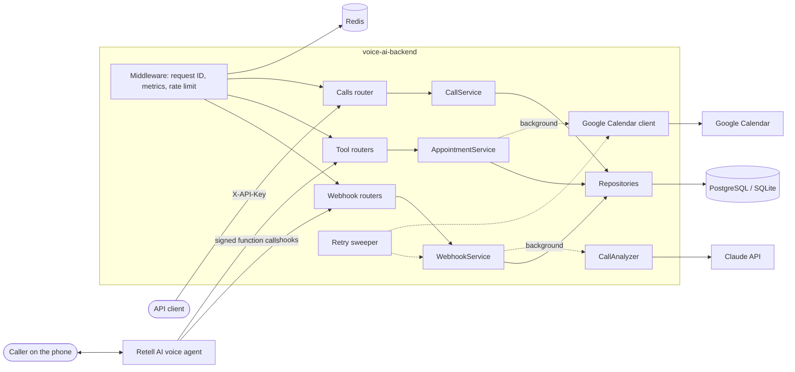
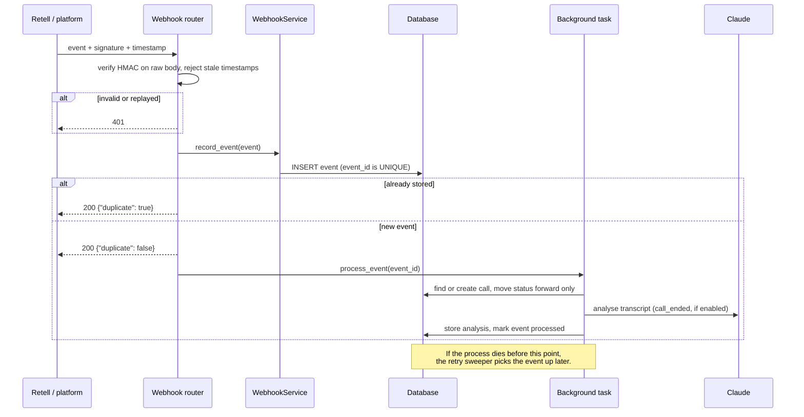

# voice-ai-backend

A production-style FastAPI backend that connects **voice AI agents** (built for [Retell AI](https://www.retellai.com/)) to **business systems**.

When someone phones the business, a Retell voice agent answers. During the call the agent calls this backend's **tools** to check availability and book appointments (in the business's own time zone, synced to Google Calendar). Afterwards Retell sends **signed webhooks** about the call, and the backend stores them, deduplicates them, and processes them durably. It then uses **Claude** to turn the transcript into a structured summary: intent, sentiment, and whether a human needs to follow up.


## Features

**Voice agent integration**
- **Retell AI**: verified `x-retell-signature` webhooks and custom function endpoints. Function calls always return a sentence the agent can speak, even on failure.
- **Agent tools**: `check-availability` and `book-appointment`, answering in milliseconds. Double booking returns `409` with alternative times.
- **Business time zone**: opening hours are local (`BUSINESS_TIMEZONE`). Times are stored in UTC and spoken in local time.
- **Google Calendar sync** (optional): busy calendar time is never offered, and every booking is copied to the calendar with idempotent, retried sync.

**AI**
- **LLM call analysis with Claude**: structured outputs (JSON schema) extract summary, sentiment, intent, the customer's name and follow-up needs. Transcripts are treated as untrusted input. The request opts into the API's refusal fallback, and a failure never affects call processing.
- **Evals**: a booking eval replays agent conversations and checks every spoken answer and the p95 latency (it runs in CI). An LLM eval scores analysis accuracy per field, including a prompt-injection case.

**Reliability**
- **Calls API** with idempotent creation (`Idempotency-Key`), cursor pagination and validated status transitions (`409`).
- **Webhooks**: HMAC signatures with **replay protection** (timestamped), deduplication by event ID, out-of-order safety, and a fast `200` with background processing.
- **Durable processing**: every event is stored first, and a sweeper retries events that were never processed (e.g. after a restart) or that failed, up to a limit.
- **Database migrations** with Alembic, plus a test that fails if models and migrations drift apart.
- **Resilient outbound client**: retries with exponential backoff, jitter and `Retry-After`, and cursor pagination.

**Operations**
- **Rate limiting**: a token bucket per API key, in memory or **shared through Redis** (an atomic Lua script) when running several instances.
- **Observability**: request-ID structured logs, **Prometheus** metrics at `/metrics`, optional **OpenTelemetry** tracing, and a **latency budget** that flags slow tool responses.
- **Deployment**: Docker (non-root, migrations on start), docker-compose with Postgres and Redis, a one-click **Render** blueprint, and GitHub Actions CI.

## Architecture



Each request passes through strict layers, which FastAPI's `Depends` wires together:

| Layer | Responsibility | Knows about HTTP? | Knows about SQL? |
|---|---|---|---|
| Routers | Parse request, call a service, return a response and status code | Yes | No |
| Integrations | Translate Retell / Google formats into the app's own schemas | No | No |
| Services | Business rules (idempotency, transitions, scheduling, analysis) | No | No |
| Repositories | Queries and persistence | No | Yes |

### Webhook flow



### Project layout

```
app/
  main.py              # App factory: middleware, routers, lifespan (sweeper)
  dependencies.py      # Depends() providers: session -> repositories -> services
  core/                # config, database, security, errors, logging, metrics, tracing
  models/              # SQLAlchemy ORM models (Call, Event, Appointment)
  schemas/             # Pydantic request/response models
  routers/             # calls, webhooks, tools, retell, health, metrics
  services/            # business logic, call analysis, retry sweeper, outbound client
  integrations/        # Retell and Google Calendar adapters
  repositories/        # database access
  middleware/          # request ID, metrics + latency budget, rate limiting
migrations/            # Alembic database migrations
evals/                 # booking eval (runs in CI) and LLM analysis eval
tests/                 # pytest suite with an isolated database per test
scripts/start.sh       # container entrypoint: migrate, then serve
docs/                  # LEARN.md, DEPLOY.md, DEMO.md
```

## Tech stack

- **Python 3.11+**, **FastAPI**, **Pydantic v2**, **pydantic-settings**
- **SQLAlchemy 2.0** + **Alembic** (SQLite by default, PostgreSQL in production)
- **Anthropic SDK** (Claude, structured outputs), **Retell AI**, **Google Calendar API**
- **Redis**, **Prometheus**, **OpenTelemetry**
- **pytest**, **ruff**, **Docker**, **Render**, **GitHub Actions**

## Quick start

### Local

```bash
python -m venv .venv
source .venv/bin/activate          # Windows: .venv\Scripts\activate
pip install -r requirements-dev.txt
cp .env.example .env               # then edit the secrets
uvicorn app.main:app --reload
```

Open <http://127.0.0.1:8000/docs>, click **Authorize**, and enter an API key from `API_KEYS`. Every integration is optional; with the defaults, everything runs offline on SQLite.

### Docker (Postgres + Redis)

```bash
docker compose up --build
```

### Deploy and connect a real phone agent

See **[docs/DEPLOY.md](docs/DEPLOY.md)**: one-click deploy to Render, then connect a Retell agent so you can phone it. [docs/DEMO.md](docs/DEMO.md) has a script for recording a demo.

## Configuration

All settings come from environment variables or `.env`. [`.env.example`](.env.example) documents every option. The most important ones:

| Variable | Default | Purpose |
|---|---|---|
| `DATABASE_URL` | `sqlite:///./voice_ai_backend.db` | Any SQLAlchemy URL; `postgres://` URLs from hosting platforms work as-is |
| `API_KEYS` | `dev-key-1` | Comma-separated keys accepted in `X-API-Key` |
| `WEBHOOK_SECRET` | `change-me-webhook-secret` | Secret for `/webhooks/voice` signatures |
| `RETELL_API_KEY` | _(empty)_ | Enables the Retell endpoints and verifies their signatures |
| `LLM_ANALYSIS_ENABLED` / `ANTHROPIC_API_KEY` | `false` / _(empty)_ | Claude transcript analysis |
| `BUSINESS_TIMEZONE` | `UTC` | IANA name, e.g. `America/New_York` |
| `REDIS_URL` | _(empty)_ | Share rate limits across instances |
| `GOOGLE_CALENDAR_ID` / `GOOGLE_SERVICE_ACCOUNT_FILE` | _(empty)_ | Google Calendar sync |
| `TOOL_LATENCY_BUDGET_MS` | `800` | Slower tool responses are logged and counted |
| `TRACING_ENABLED` | `false` | OpenTelemetry export (configure with `OTEL_*` variables) |

## API overview

| Method & path | Auth | Purpose |
|---|---|---|
| `POST /calls` | API key | Create a call (idempotent with `Idempotency-Key`) |
| `GET /calls` | API key | List calls, filter by `status`/`agent_id`, cursor pagination |
| `GET /calls/{id}` | API key | Fetch a call |
| `PATCH /calls/{id}` | API key | Change status (`registered -> ongoing -> ended/error`) |
| `GET /calls/{id}/summary` | API key | Call + transcript + LLM analysis + events + bookings |
| `POST /calls/{id}/analyze` | API key | Run LLM analysis now |
| `POST /tools/check-availability` | API key | Free slots for a day, plus a spoken sentence |
| `POST /tools/book-appointment` | API key | Book a slot, plus a spoken confirmation |
| `POST /webhooks/voice` | HMAC signature | Generic call lifecycle webhooks |
| `POST /webhooks/retell` | Retell signature | Retell call webhooks |
| `POST /retell/functions/check-availability` | Retell signature | Retell custom function |
| `POST /retell/functions/book-appointment` | Retell signature | Retell custom function |
| `GET /health` | none | Liveness + database check |
| `GET /metrics` | none | Prometheus metrics |

### Examples

```bash
export API_KEY=dev-key-1 BASE=http://127.0.0.1:8000
```

**Create a call (idempotent)**

```bash
curl -s -X POST $BASE/calls \
  -H "X-API-Key: $API_KEY" -H "Idempotency-Key: create-1" -H "Content-Type: application/json" \
  -d '{"agent_id": "agent_front_desk", "from_number": "+14155550123", "to_number": "+14155550199", "external_call_id": "call_abc"}'
```

Sending the same request again returns the same call with `Idempotent-Replayed: true`.

**Send a signed webhook**

The signature is HMAC-SHA256 over `"<timestamp>.<body>"`. Requests older than five minutes are rejected, so a captured request can't be replayed.

```bash
BODY='{"event_id":"evt_1","event_type":"call_ended","call":{"call_id":"call_abc","transcript":"Agent: Hi!\nUser: Book me for Tuesday."}}'
TS=$(date +%s)
SIG=$(printf '%s.%s' "$TS" "$BODY" | openssl dgst -sha256 -hmac "change-me-webhook-secret" -hex | sed 's/^.* //')

curl -s -X POST $BASE/webhooks/voice \
  -H "Content-Type: application/json" -H "X-Webhook-Timestamp: $TS" -H "X-Signature: sha256=$SIG" \
  -d "$BODY"
```

**Agent tools**

```bash
curl -s -X POST $BASE/tools/check-availability \
  -H "X-API-Key: $API_KEY" -H "Content-Type: application/json" -d '{"date": "2030-01-15"}'
# {"available": true, "slots": [...], "message": "On Tuesday, January 15, I have openings at 9:00 AM, 9:30 AM and 10:00 AM among others."}

curl -s -X POST $BASE/tools/book-appointment \
  -H "X-API-Key: $API_KEY" -H "Content-Type: application/json" \
  -d '{"customer_name": "Jane Doe", "customer_phone": "+14155550123", "start_time": "2030-01-15T10:00:00", "call_id": "call_abc"}'
# {"appointment_id": "...", "message": "You're all set, Jane! Your appointment is booked for Tuesday, January 15 at 10:00 AM."}
```

**Summary, including the LLM analysis**

```bash
curl -s $BASE/calls/<id>/summary -H "X-API-Key: $API_KEY"
```

### Error format

```json
{"error": {"code": "INVALID_STATUS_TRANSITION", "message": "Cannot change call status from 'ended' to 'ongoing'."}}
```

`/tools/*` responses also include a top-level `message`, even on errors. The Retell function endpoints always answer `200` with `{"ok": false, "message": ...}` on failure, so the agent's LLM gets a sentence to say rather than a failed function call.

## Testing and evals

```bash
pytest                              # 140+ tests, isolated database per test, no network
ruff check . && ruff format --check .
python -m evals.run_booking_eval    # agent conversation replay: correctness + p95 latency
python -m evals.run_analysis_eval --yes   # LLM accuracy per field (calls Claude, costs cents)
```

The tests cover every endpoint's success and error paths (`401`, `404`, `409`, `422`, `429`, `503`) and duplicate, out-of-order, replayed and tampered webhooks. They also cover Retell signatures, event retries, migrations in sync with models, the Redis Lua script (via fakeredis), Google Calendar (mocked), LLM handling (fake client), metrics and tracing. External services are always simulated.

## Design decisions

**Idempotency keys.** A client may retry a request whose response was lost. The key is stored under a unique constraint together with a hash of the body. The same key and body returns the original call; the same key with a different body returns `422`, because that is a client bug.

**HMAC signatures with timestamps.** The webhook URL is public, so the signature proves who sent a request. Signing the timestamp together with the raw body, and rejecting old timestamps, also stops an attacker from replaying a captured request. Retell's own scheme follows the same idea.

**Store first, process later, retry forever-ish.** Webhook senders retry slow responses, so the service only stores the event and answers `200`. Processing happens in the background and is idempotent (statuses only move forward, fields are only filled in). Because the event is already stored, a crash only delays processing: the sweeper retries it, up to `EVENT_MAX_ATTEMPTS`, after which it waits for manual review.

**Speakable failures.** A voice agent can't show an error dialog. Every tool response carries a `message` that works when read aloud, including conflicts ("that time was just taken, how about 10:30?").

**LLM as an enhancement, not a dependency.** Analysis runs off the hot path with structured outputs, a refusal fallback, a strict schema and fenced, untrusted transcripts. If Claude is down, calls are still processed; the analysis is simply missing.

**Latency is a feature.** Callers notice silence of about a second. Tool endpoints do only indexed queries, calendar sync happens after the response, the calendar lookup has a short timeout with graceful fallback, and a latency budget turns slow responses into metrics and warnings. The CI eval also checks p95 latency.

**Shared state for scale.** In-memory rate limiting is correct for one instance. With `REDIS_URL`, buckets move to Redis, and an atomic Lua script ensures two instances can't both spend the last token.

## Future improvements

- Multiple staff or resources per business, and appointment cancellation/rescheduling tools.
- A dedicated job queue (e.g. Celery, Cloud Tasks) if background work outgrows the in-process sweeper.
- Alerting rules and a Grafana dashboard for the exported metrics.
- An LLM-as-judge grader for summary quality, in addition to the exact-match fields in the analysis eval.

## Learning guide

New to this kind of backend? [`docs/LEARN.md`](docs/LEARN.md) explains the architecture with a restaurant analogy and traces a request through every file.
